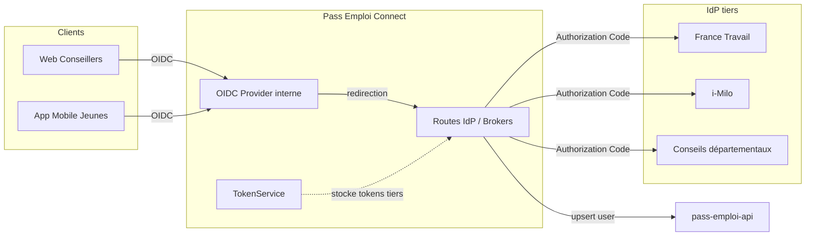

# Architecture — Pass Emploi Connect

Vue d’ensemble technique du service d’authentification et de fédération d’identités de l’écosystème Pass Emploi. Ce document complète AUTHENTICATION.md (flux OIDC/OAuth2) par une description des composants, des interactions et de l’architecture interne.

## Sommaire
- [Objectifs et périmètre](#objectifs-et-périmètre)
- [Vue d’ensemble des composants](#vue-densemble-des-composants)
- [Architecture interne (dans ce dépôt)](#architecture-interne-dans-ce-dépôt)
- [Fichiers et points d’extension clés](#fichiers-et-points-dextension-clés)
- [Flux principaux](#flux-principaux)
- [Configuration et dépendances](#configuration-et-dépendances)
- [Sécurité](#sécurité)
- [Déploiement et environnements](#déploiement-et-environnements)
- [Observabilité (logs/erreurs)](#observabilité-logserreurs)
- [Développement local](#développement-local)
- [Voir aussi](#voir-aussi)

## Objectifs et périmètre
- Fournir un fournisseur d’identité OIDC interne pour les applications Pass Emploi (Web conseillers, App bénéficiaires), compatible Keycloak (well-known, tokens, sessions, JWKS).
- Déléguer l’authentification à des IdP tiers selon le profil (conseillers/bénéficiaires) : France Travail (FT), i‑Milo, et Conseils départementaux.
- Persister/actualiser l’utilisateur dans pass-emploi-api et stocker de façon sécurisée les jetons tiers pour la délégation d’appels API.

## Vue d’ensemble des composants

## Architecture interne (dans ce dépôt)
- NestJS
  - Controllers (src/idp/**/…controller.ts) : points d’entrée HTTP pour démarrer les connexions vers chaque IdP et gérer les callbacks.
  - Services d’IdP (src/idp/**/…service.ts) : implémentent le flux OIDC côté tiers, s’appuient sur IdpService.
  - OIDC Provider (src/oidc-provider/*) : encapsule oidc-provider pour exposer des endpoints Keycloak‑compatibles et gérer les interactions (login, consent, grant).
  - Token store (src/token/*) : stockage et rafraîchissement des access/refresh tokens des IdP tiers.
  - API clients (src/api/*) : PassEmploiAPIClient et FranceTravailAPIClient.
  - Configuration (src/config/*) : schéma, lecture des variables d’environnement et configuration des IdP.
  - Domaine (src/domain/*) : types User, Account, etc.

## Fichiers et points d’extension clés
- src/idp/service/idp.service.ts
  - getAuthorizationUrl(interactionId, state?) : construit l’URL d’autorisation chez l’IdP tiers.
  - callback(request, response) : traite le retour de l’IdP tiers : échange code→tokens, récupération userinfo, enrichissement (coordonnées FT le cas échéant), persistance via pass-emploi-api, création de la session OIDC, stockage des tokens tiers.
- src/config/configuration.ts
  - Déclare les IdP supportés (France Travail conseiller/jeune, Milo conseiller/jeune, Conseiller départemental) + scopes, redirectUri, well‑known/endpoints, JWKS si nécessaire.
- src/idp/francetravail-*/**.controller.ts et src/idp/milo-*/**.controller.ts
  - Exposent les routes /{idp}/connect/:interactionId et les endpoints de callback /auth/realms/pass-emploi/broker/{alias}/endpoint.

## Flux principaux
1) Client Web/App → Pass Emploi Connect (Authorization Code). Une interaction est démarrée et un interactionId (nonce) est généré.
2) Redirection → IdP tiers avec nonce et éventuellement state (pour distinguer des variantes FT : aij, brsa, cej, etc.).
3) Callback de l’IdP → Pass Emploi Connect : échange code→tokens, récupération userinfo, vérifications et persistance utilisateur.
4) Création de session OIDC : génération/association d’un grantId, finalisation de l’interaction, émission des tokens pour le client, stockage sécurisé des tokens tiers.

Pour le détail protocolaire, voir AUTHENTICATION.md (diagramme de séquence et notes spécifiques conseillers vs bénéficiaires).

## Configuration et dépendances
- IdP tiers et variantes configurés dans src/config/configuration.ts (issuer, well‑known ou endpoints explicites, scopes, redirectUri, logout, JWKS).
- Dépendances clés : oidc-provider, openid-client, NestJS, clients API internes (Pass Emploi, France Travail le cas échéant).

## Sécurité
- Scopes minimaux par IdP et stockage sécurisé des refresh tokens tiers (TokenService).
- Vérification spécifique pour les conseillers départementaux (email/domaines autorisés via authorizedConseillersDept).
- Publication des clés de signature via JWKS et rotation recommandée (voir AUTHENTICATION.md — Clés et JWKS).

## Déploiement et environnements
- Les URLs (well‑known, endpoints, redirectUri) diffèrent selon l’environnement (qualif, prod). Se référer à la configuration déployée et aux variables d’environnement.

## Observabilité (logs/erreurs)
- Journalisation des étapes clés du flux (début interaction, redirection IdP, callback, upsert API, finalisation).
- Attention à ne jamais loguer d’access/refresh tokens ni de données sensibles.

## Développement local
- Utiliser docker-compose.yml pour lancer les dépendances nécessaires si disponibles.
- Générer les clés JWKS si besoin (voir AUTHENTICATION.md — Clés et JWKS).
- Scénarios manuels : démarrer une interaction /authorize, suivre la redirection vers un IdP de qualification, puis revenir sur le callback broker.

## Voir aussi
- AUTHENTICATION.md : flux d’authentification/autorisation, endpoints et découverte OIDC.
