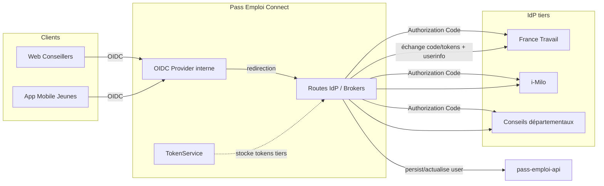
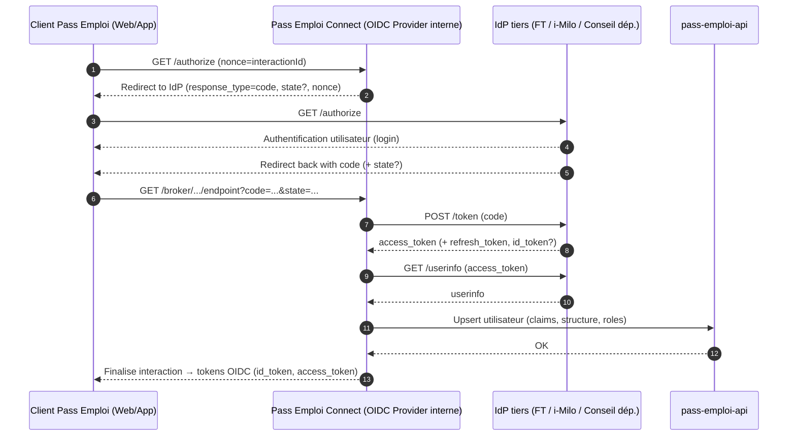

# Authentification et Autorisation

Une présentation claire des flux OIDC/OAuth2 utilisés par Pass Emploi Connect, avec liens utiles et schémas.

## Sommaire
- [Rappels théoriques](#rappels-théoriques)
- [Rôle de Pass Emploi Connect](#rôle-de-pass-emploi-connect)
- [Découverte (well-known) et endpoints — pourquoi et quand les utiliser](#découverte-well-known-et-endpoints--pourquoi-et-quand-les-utiliser)
- [Vue d’ensemble des flux](#vue-densemble-des-flux)
- [Implémentation dans ce repo](#implémentation-dans-ce-repo)
- [Comprendre et faire évoluer les routes](#comprendre-et-faire-évoluer-les-routes)
- [Notes spécifiques conseiller vs bénéficiaire](#notes-spécifiques-conseiller-vs-bénéficiaire)
- [Gestion des sessions et grants](#gestion-des-sessions-et-grants)
- [Clés et JWKS](#clés-et-jwks)
- [Bonnes pratiques](#bonnes-pratiques)
- [Voir aussi](#voir-aussi)

## Rappels théoriques
- [OAuth 2.0](https://www.rfc-editor.org/rfc/rfc6749) définit la délégation d’autorisation (accès à des ressources via des tokens).
- [OpenID Connect](https://openid.net/specs/openid-connect-core-1_0.html) (OIDC) est une couche d’identité au‑dessus d’OAuth 2.0 qui standardise l’authentification de l’utilisateur (ID Token, UserInfo, [discovery](https://openid.net/specs/openid-connect-discovery-1_0.html)).
- Le flux [Authorization Code](https://openid.net/specs/openid-connect-core-1_0.html#CodeFlowAuth) est recommandé pour les clients Web et mobiles, idéalement avec [PKCE](https://www.rfc-editor.org/rfc/rfc7636).

## Rôle de Pass Emploi Connect
- Sert de fournisseur [OIDC](https://openid.net/specs/openid-connect-core-1_0.html) « interne » aux clients Pass Emploi (Web conseillers, App bénéficiaires) via oidc-provider.
- Délègue l’authentification à des IdP tiers selon le profil utilisateur : France Travail (FT) et i‑Milo, ou Conseils départementaux pour certains conseillers.
- Expose des endpoints « Keycloak‑compatibles » (chemins [well‑known](https://openid.net/specs/openid-connect-discovery-1_0.html), broker/endpoint) pour s’intégrer aisément aux clients existants.

Vue d’ensemble des composants

## Découverte (well-known) et endpoints — pourquoi et quand les utiliser
La « découverte » [well‑known OpenID Connect](https://openid.net/specs/openid-connect-discovery-1_0.html) expose, via un seul document JSON, toutes les URLs et capacités d’un fournisseur OIDC (authorize, token, userinfo, [JWKS](https://www.rfc-editor.org/rfc/rfc7517), etc.).

À quoi ça sert ici ?
- Côté clients (Web/App), cela permet de configurer Pass Emploi Connect avec une seule URL well‑known.
- Côté intégrations tierces (France Travail, i‑Milo), nous consommons leurs well‑known pour créer dynamiquement les clients (openid-client) et éviter de « dur‑coder » les endpoints.

Exemples d’URL de découverte (environnements de qualification) :
- Pass Emploi Connect : https://id.pass-emploi.incubateur.net/auth/realms/pass-emploi/.well-known/openid-configuration
- France Travail — Conseiller : https://authentification-agent-va.pe-qvr.net/connexion/oauth2/.well-known/openid-configuration?realm=/agent
- France Travail — Bénéficiaire : https://authentification-candidat-r.ft-qvr.fr/connexion/oauth2/realms/root/realms/individu/.well-known/openid-configuration
- i‑Milo — Conseiller : https://sso-qlf.i-milo.fr/auth/realms/imilo-qualif/.well-known/openid-configuration
- i‑Milo — Jeune : https://sso-qlf.i-milo.fr/auth/realms/sue-jeunes-qualif/.well-known/openid-configuration

Note : en production, utilisez la well‑known de l’instance réellement déployée. Les URLs ci‑dessus sont données à titre d’exemple et peuvent évoluer.

## Vue d’ensemble des flux
1) Le client Pass Emploi (Web ou App) initie une connexion auprès de Pass Emploi Connect ([OIDC Authorization Code](https://openid.net/specs/openid-connect-core-1_0.html#CodeFlowAuth)). Une interaction est créée et un interactionId (utilisé comme nonce) est généré.
2) Pass Emploi Connect redirige vers l’IdP tiers cible avec : response_type=code, client_id, redirect_uri, scope, nonce=interactionId, et éventuellement state pour distinguer des variantes (ex. FT « aij », « brsa », « cej », « accompagnement‑intensif », etc.).
3) L’IdP tiers authentifie l’utilisateur et redirige vers Pass Emploi Connect avec un code d’autorisation (et le state le cas échéant).
4) Pass Emploi Connect échange le code contre des tokens (access_token, refresh_token, id_token si fourni), appelle l’endpoint userinfo, et pour les jeunes FT peut compléter les coordonnées via l’API FT.
5) Pass Emploi Connect persiste/actualise l’utilisateur dans pass-emploi-api, crée/associe un grant à la session OIDC côté Connect, finalise l’interaction et émet les tokens OIDC pour le client Pass Emploi.
6) Les tokens tiers sont stockés par TokenService (par utilisateur + structure/type) pour des appels API délégués et pour permettre le rafraîchissement.

Diagramme de séquence — Flux Authorization Code (avec délégation IdP tiers)

## Implémentation dans ce repo
- Abstraction : src/idp/service/idp.service.ts
  - getAuthorizationUrl(interactionId, state?) construit l’URL d’autorisation du tiers (openid-client, Issuer/Client).
  - callback() gère : callbackParams → échange code→tokens → userinfo → enrichissement (coordonnées FT) → vérification (ex. conseiller départemental) → upsert utilisateur via pass-emploi-api → création session/grant → stockage tokens tiers via TokenService → interactionFinished().
- Configuration des IdP : src/config/configuration.ts
  - idps.francetravailBeneficiaire, idps.francetravailConseiller, idps.miloConseiller, idps.miloJeune, idps.conseillerDept avec issuer, authorizationUrl, tokenUrl, userinfo, scopes, redirectUri, jwks, logout.
- OIDC Provider interne : src/oidc-provider/*
  - Fournit les endpoints OpenID Connect (well-known, authorize, token, userinfo, logout, etc.) et la gestion des interactions (grantId, consent).
- Stockage et rafraîchissement des tokens tiers : src/token/*
- Appels API : src/api/pass-emploi-api.client.ts (persistance utilisateur), src/api/francetravail-api.client.ts (coordonnées FT pour jeunes).

## Comprendre et faire évoluer les routes
Plutôt que de lister des URLs susceptibles de changer, voici comment cela fonctionne et où regarder dans le code :

- Point d’entrée côté Connect : des contrôleurs par IdP/profil exposent des routes « connect » qui prennent un `interactionId` (servant de nonce) et, parfois, un `type` pour les variantes France Travail.
  - Exemple (pattern) : `GET /<idp>-<profil>/connect/:interactionId[?type=...]`
  - Les callbacks des IdP reviennent sur l’endpoint broker d’oidc-provider : `GET /auth/realms/pass-emploi/broker/<broker>/endpoint`.
- Où c’est implémenté :
  - Service d’abstraction IdP : `src/idp/service/idp.service.ts` (construction de l’URL d’autorisation, callback, stockage tokens, finalisation d’interaction).
  - Exemple de contrôleur FT Conseiller : `src/idp/francetravail-conseiller/francetravail-conseiller.controller.ts`.
  - Autres profils/IdP suivent le même principe (répertoires `src/idp/*`).
- Ajouter un nouvel IdP ou une variante :
  1) Déclarer sa configuration dans `src/config/configuration.ts` (issuer, endpoints ou [well‑known](https://openid.net/specs/openid-connect-discovery-1_0.html), scopes, redirectUri, [JWKS](https://www.rfc-editor.org/rfc/rfc7517) si nécessaire).
  2) Implémenter un contrôleur (routes `connect` et `callback`) en s’appuyant sur `IdpService`.
  3) Si besoin, ajouter la logique d’enrichissement/vérification dans le service concerné.
  4) Mettre à jour la configuration de mapping des brokers (nom du broker utilisé dans l’URL de callback) pour que oidc-provider route correctement l’endpoint.

## Notes spécifiques conseiller vs bénéficiaire
- Conseiller : la structure (FRANCE_TRAVAIL, MILO, AVENIR_PRO, POLE_EMPLOI_*…) est déterminée via le paramètre type quand applicable et persistée côté pass-emploi-api. Des vérifications additionnelles peuvent s’appliquer (ex. conseiller départemental : filtre sur l’email via authorizedConseillersDept).
- Bénéficiaire/Jeune (FT) : après userinfo, les coordonnées peuvent être complétées via l’API FT avec l’access_token FT. Le user est ensuite upsert dans pass-emploi-api.

## Gestion des sessions et grants
- interactionDetails(request, response) permet de récupérer l’UID d’interaction et le grant courant.
- generateNewGrantId() crée ou met à jour le grant Id pour le client_id.
- interactionFinished() scelle la session : les claims (userType, userStructure, roles, etc.) sont stockés côté provider et seront présentés dans l’ID Token/UserInfo.

## Clés et JWKS
- Les clés de signature/chiffrement sont gérées via [JWKS](https://www.rfc-editor.org/rfc/rfc7517). Génération locale :
  - `yarn generate-key-pair`
  - Copier la clé générée dans la variable d’environnement JWKS (au moins 2 clés recommandées pour rotation).
- La découverte OIDC [well‑known](https://openid.net/specs/openid-connect-discovery-1_0.html) expose l’URL JWKS publique consommée par les clients.

## Bonnes pratiques
- Utiliser des scopes minimaux à l’IdP tiers.
- Utiliser PKCE côté clients publics (mobile).
- Gérer la rotation des clés JWKS et la révocation éventuelle des refresh tokens tiers.

## Voir aussi
- ARCHITECTURE.md pour la vue d’ensemble technique et l’architecture interne du code.
