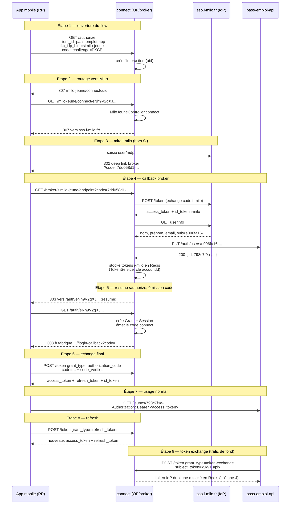

# Flow d'authentification — broker OIDC

> Explication du flow implémenté par connect, illustrée par le cas concret d'un
> jeune MiLo (app mobile). Les autres IdP (FT Connect, Conseil Départemental)
> suivent le même schéma en remplaçant l'IdP et le `kc_idp_hint`.
> Conventions de logging (taxonomie, ECS) : voir la doc d'équipe
> `pass-emploi-tools/docs/logs-ecs/`, non dupliquées ici.

## Vocabulaire

| Terme | Définition |
|---|---|
| **OP** (OpenID Provider) | Le serveur qui authentifie et délivre des tokens. **connect est notre OP** (lib `oidc-provider`), avec des routes compatibles Keycloak (`/auth/realms/pass-emploi/...`, héritage de l'ancien IdP) |
| **RP** (Relying Party) | Un client qui délègue son authent à un OP. App mobile, web, Swagger sont des RP de connect |
| **broker** | connect est lui-même **RP des IdP externes** (i-milo, FT Connect) : il authentifie l'utilisateur ailleurs, puis émet ses propres tokens |
| **IdP externe** | Le fournisseur d'identité qui détient les credentials : i-milo (jeunes/conseillers MiLo), FT Connect (France Travail) |
| **Interaction** | Concept `oidc-provider` : quand `/authorize` arrive sans session valide, l'OP crée une interaction (`uid`, cookie `_interaction`, TTL 1h) qui matérialise le login en cours |
| **Grant** | Enregistrement des scopes accordés par un utilisateur à un client (Redis, TTL 42 j) |
| **Session** | Session SSO de connect (cookie `_session`, 42 j) : permet de ré-émettre un code sans repasser par l'IdP |
| **accountId** | Identifiant interne composite `TYPE\|STRUCTURE\|sub` (ex. `JEUNE\|MILO\|e096fa16…`). Le `sub` est l'identifiant **chez l'IdP**, différent de l'id interne api |
| **authorization code flow** | Flow OIDC standard : le client reçoit un `code` à usage unique par redirection, puis l'échange contre les tokens en backend (`POST /token`). Sécurisé par **PKCE** côté mobile |
| **PKCE** | L'app génère un secret `code_verifier` (gardé en mémoire), envoie son hash `code_challenge` à l'étape 1 ; l'échange du code à l'étape 6 doit fournir le `code_verifier` original — protège contre le vol du code en transit |
| **Deep link** | `fr.fabrique.social.gouv.passemploi://login-callback` : URL de retour de l'app, interceptée par l'OS |
| **AppAuth** | Lib mobile (`flutter_appauth`) qui gère tout le flow côté app : discovery, custom tab, réception du deep link, échange du code |
| **Token exchange** | Grant custom (RFC 8693) : l'**api** présente son propre JWT à connect pour récupérer le token **IdP** d'un utilisateur (stocké en Redis lors de son login), afin d'appeler les API partenaires en son nom |

## Le flow, avec un exemple concret

Exemple réel (jeune MiLo) :
`sub` i-milo = `e096fa16-22ea-4fea-9c6f-38454a16fab5`, id interne api =
`798c7f9a-97e9-4760-9d4c-fcb305dc1bb8`, `accountId` = `JEUNE|MILO|e096fa16-22ea-4fea-9c6f-38454a16fab5`.

## Détail de chaque étape

**Étape 1 — ouverture du flow.** L'app ouvre une **Custom Tab** (Chrome
intégré, pas un navigateur externe) sur `/authorize` avec `kc_idp_hint`
identifiant l'IdP cible et un `code_challenge` PKCE. Si un cookie `_session`
valide existe déjà (login précédent), `oidc-provider` vérifie d'abord que ce
compte existe toujours côté api (check `account_not_found` dans
`oidc.service.ts` : `findAccount` → `GET /auth/users/:sub` — un 404 forcerait
un re-login au lieu de réutiliser la session). Sinon, ou si le check passe et
qu'un nouveau login est quand même demandé, `oidc-provider` crée une
**Interaction** en Redis (`Interaction:<uid>`, TTL 3600s) et pose le cookie
`_interaction` (`sameSite: lax` — nécessaire pour survivre au retour de
navigation top-level depuis l'IdP externe).

**Étape 2 — routage vers l'IdP.** `interactions.url()` (`oidc.service.ts`) lit
`kc_idp_hint` et redirige vers le controller dédié (`MiloJeuneController`,
`FrancetravailJeuneController`…). Celui-ci construit l'URL d'autorisation vers
le **vrai IdP**, avec en `nonce` l'uid de l'interaction — vérifié plus tard sur
l'id_token reçu.

**Étape 3 — mire externe.** Hors de notre système. L'IdP authentifie et
prépare une redirection avec **son propre** `code` (celui d'i-milo, différent
du code connect émis plus tard).

**Étape 4 — callback broker (`IdpService.callback`, `idp.service.ts`).** Le
cookie `_interaction` posé à l'étape 1 revient avec cette requête (même
domaine) → l'interaction est retrouvée. Séquence :
1. échange du code **IdP** contre des tokens **IdP** (`client.callback`) ;
2. `userinfo` chez l'IdP → nom/prénom/email/`sub` ;
3. `PUT /auth/users/:sub` vers **notre api** — upsert de l'utilisateur
   (table `jeune`/`conseiller`), renvoie l'**id interne** (`798c7f9a-...`),
   différent du `sub` IdP ;
4. stockage des tokens IdP en Redis, clé = `accountId` (`TokenService`) — ils
   serviront à l'étape 9 ;
5. `interactionFinished` : marque l'interaction résolue avec le résultat
   (`accountId`, `userId`, rôles…) → 303 vers l'URL de résumé du flow
   `/authorize` d'origine.

**Étape 5 — resume et émission du code.** `oidc-provider` reprend le flow
ouvert à l'étape 1, voit l'interaction résolue, crée un **Grant** (autorisations
du client) et une **Session** (cookie `_session`, TTL 42 j — permet de
resauter directement ici sans repasser par l'IdP tant qu'elle est valide),
génère un **authorization code connect** (`AuthorizationCode:<id>` en Redis,
TTL ~1 min, usage unique), et redirige vers le deep link de l'app avec ce code.

**Étape 6 — échange final.** Normalement immédiat côté app (même appel
`authorizeAndExchangeCode` d'AppAuth que l'ouverture du flow). Connect vérifie
le code (non consommé, TTL) et le `code_verifier` PKCE, résout le compte
(déjà connu via l'interaction), émet `access_token` (JWT), `refresh_token`
(opaque, Redis `RefreshToken:<id>`, TTL 42 j), `id_token`. Le code est marqué
`consumed` (gardé pour détecter un replay).

**Étape 7 — usage normal.** L'app envoie l'`access_token` en
`Authorization: Bearer`. L'api valide juste la signature JWT (`OidcAuthGuard`),
sans round-trip vers connect.

**Étape 8 — refresh.** Avant expiration de l'`access_token`, l'app échange le
`refresh_token`. Si la clé Redis correspondante n'existe plus (TTL dépassé,
compte réinitialisé) → `invalid_grant: refresh token not found`.

**Étape 9 — token exchange (RFC 8693).** Quand l'api doit appeler un partenaire
(ex. `api.i-milo.fr`) pour le compte d'un utilisateur, elle présente son propre
JWT applicatif à connect (`grant_type=urn:ietf:params:oauth:grant-type:token-exchange`).
`TokenExchangeGrant` relit le token IdP stocké en Redis à l'étape 4 (le
rafraîchissant si besoin) et le restitue à l'api.

## Retrouver le flow dans les logs : la recette (2 filtres, +1 optionnel)

Point de départ habituel : un `jeune.id` côté api. `login_completed` (étape 4)
est **le pivot** — c'est le seul log qui porte à la fois `user.id` (jeune.id
api, posé dans le `RequestContext` juste après le PUT réussi) et
`labels.interaction_id` (posé en tout début de callback). `login_flow_started`
(étape 1), lui, ne peut **pas** servir de point de départ : à ce moment
l'utilisateur n'est pas encore identifié, il ne porte donc jamais `user.id` —
ce n'est pas un manque, c'est chronologiquement impossible.

1. **Filtre 1** — `message:"login_completed" AND user.id:"<jeune.id>"` → un
   résultat, donne `labels.interaction_id`.
2. **Filtre 2** — `labels.interaction_id:"<valeur>"` → tout le reste des
   étapes 1/2/4/5 : `login_flow_started`, `login_initiated`/`login_redirected`,
   `login_completed`, `authorization_succeeded` (qui donne `labels.account_id`),
   **et le `request_completed` du vrai `/authorize` initial** (avec
   `client_id`, `redirect_uri`, `code_challenge`, `scope`, `state`, `nonce` en
   clair dans `url.path`) — ce dernier hérite de `labels.interaction_id` parce
   que le hook `interaction.started` le pose dans le `RequestContext` dès la
   création de l'interaction, avant que la réponse ne parte.
3. **Filtre 3 (optionnel)** — `labels.account_id:"<valeur>"` → `grant_succeeded`/
   `grant_error` (étapes 6/8/9, token/refresh/exchange), une fois l'interaction
   expirée.

`authorization_succeeded` est le seul log qui porte **à la fois**
`labels.interaction_id` et `labels.account_id` : c'est la jonction entre le
monde « interaction » (1-5) et le monde « accountId » (6-8-9).

### Hors scope volontaire : le check `findAccount` (session existante)

Le `GET /auth/users/:sub` déclenché côté api par le check `account_not_found`
(étape 1, session SSO préexistante) ne porte **aucun** corrélateur commun avec
`labels.interaction_id` — seul `trace.id` (APM) le relie à `login_flow_started`,
et `trace.id` ne couvre qu'une seule requête HTTP (pas tout le flow). Fermer ce
trou demanderait de propager `interaction_id` en header jusqu'à l'api : pas
fait, volontairement — ce check est un cas marginal (ne se déclenche que s'il
existe déjà une session), pas central pour diagnostiquer une boucle de login.
À creuser en dernier recours via `trace.id` si vraiment nécessaire.

## Pointeurs code

| Étape | Fichier |
|---|---|
| 1, 2, 5 (config routes/interactions) | `src/oidc-provider/oidc.service.ts` |
| 2 (controller MiLo jeune) | `src/idp/milo-jeune/milo-jeune.controller.ts` |
| 4 (callback générique, partagé par tous les IdP) | `src/idp/service/idp.service.ts` |
| 4 (stockage tokens IdP) | `src/token/token.service.ts` |
| 9 (token exchange) | `src/oidc-provider/token-exchange.grant.ts` |
| Redis (interactions/grants/codes/refresh) | `src/redis/redis.adapter.ts` |